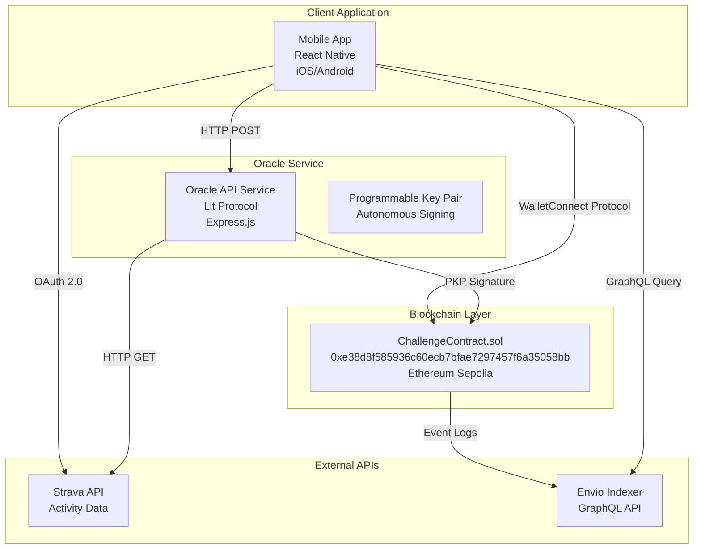
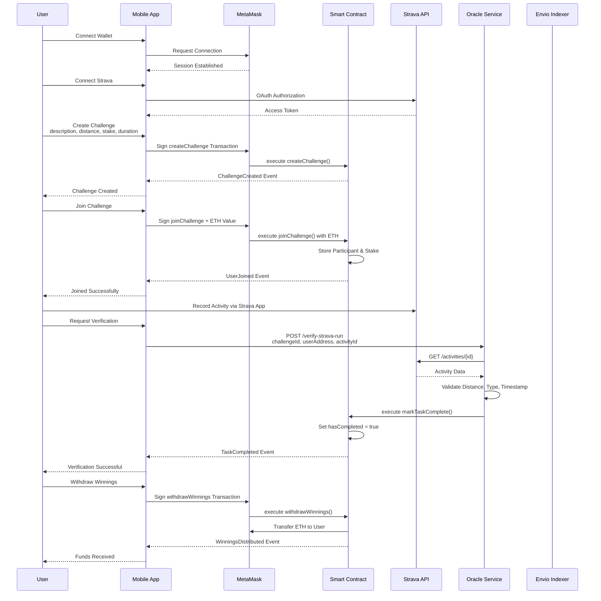
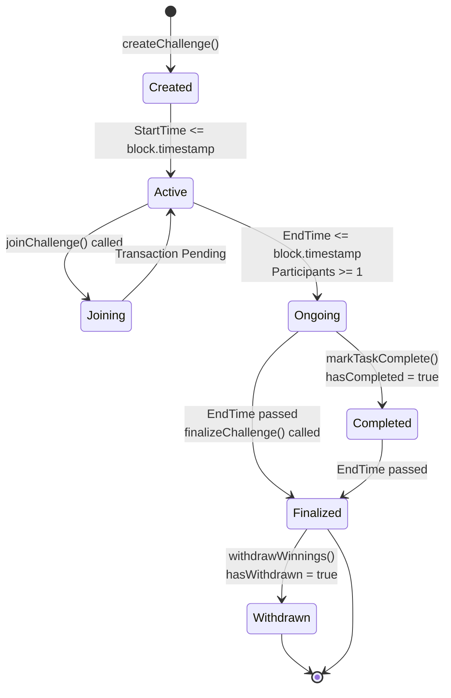
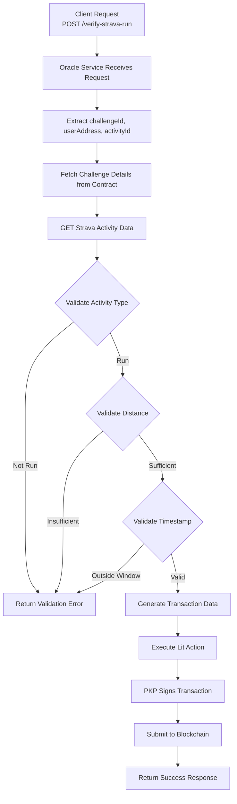

<div align="center">

# FitStake


**Decentralized Fitness Challenge Platform**

A Web3-powered platform that incentivizes fitness through cryptocurrency stakes and automated verification

[](https://reactnative.dev/)
[](https://soliditylang.org/)
[](https://opensource.org/licenses/MIT)

</div>

---

## Table of Contents

- [Overview](#overview)
- [System Architecture](#system-architecture)
- [Technology Stack](#technology-stack)
- [Key Features](#key-features)
- [Installation](#installation)
- [Configuration](#configuration)
- [Smart Contracts](#smart-contracts)
- [Oracle System](#oracle-system)
- [API Reference](#api-reference)
- [Development](#development)
- [Testing](#testing)
- [Deployment](#deployment)
- [Contributing](#contributing)

---

## Overview

FitStake is a decentralized application that enables users to create and join fitness challenges with cryptocurrency stakes. The platform combines blockchain technology, oracle services, and fitness tracking APIs to create a transparent and automated challenge system.

### Core Concept

Users stake cryptocurrency (ETH) to participate in fitness challenges. Upon completion, activities are verified through the Strava API by an oracle service. Successful participants receive rewards, while failed challenges distribute stakes to winners.

### Problem Statement

Traditional fitness apps lack meaningful incentives. Without financial commitment, users frequently abandon goals. FitStake addresses this by requiring cryptocurrency stakes, creating real economic incentives for challenge completion.

---

## System Architecture

### High-Level Architecture



### Data Flow Sequence



### Smart Contract State Machine



---

## Technology Stack

### Frontend

| Component | Technology | Version | Purpose |
|-----------|-----------|---------|---------|
| Framework | React Native | 0.81.5 | Cross-platform mobile development |
| Platform | Expo | 54.0.17 | Build system and tooling |
| Styling | NativeWind | 2.0.11 | Tailwind CSS for React Native |
| Navigation | React Navigation | 7.x | Routing and screen management |
| Blockchain | ethers.js | 6.15.0 | Ethereum library for contract interaction |
| Wallet | WalletConnect | 2.22.4 | Decentralized wallet connection protocol |
| Charts | Victory Native | 41.20.1 | Data visualization components |
| State | React Context | - | Global state management |

### Backend

| Component | Technology | Version | Purpose |
|-----------|-----------|---------|---------|
| Oracle Framework | Lit Protocol | 4.0.0 | Decentralized oracle infrastructure |
| API Server | Express.js | 4.21.2 | HTTP API service |
| Language | TypeScript | 5.8.0 | Type-safe development |
| Execution | tsx | 4.0.0 | TypeScript execution |

### Smart Contracts

| Component | Technology | Version | Purpose |
|-----------|-----------|---------|---------|
| Language | Solidity | 0.8.28 | Smart contract development |
| Framework | Hardhat | 3.0.7 | Development environment |
| Deployment | Hardhat Ignition | 3.0.3 | Automated deployment |
| Testing | Hardhat Test | - | Contract testing framework |

### Infrastructure

| Service | Technology | Purpose |
|---------|-----------|---------|
| Blockchain Network | Ethereum Sepolia | Testnet deployment |
| Block Explorer | Sepolia Etherscan | Transaction verification |
| Indexer | Envio | Blockchain data indexing |
| Fitness API | Strava API | Activity data source |
| OAuth Server | Express.js | Strava authentication flow |

---

## Key Features

### Challenge Management

Create custom fitness challenges with configurable parameters:
- Challenge description
- Target distance (in meters)
- Stake amount (in ETH)
- Start time and duration

### Staking Mechanism

Secure cryptocurrency staking:
- Participants stake ETH equal to challenge requirement
- Funds locked in smart contract
- Automatic distribution upon challenge completion

### Oracle Verification

Automated activity verification:
- Oracle service validates Strava activities
- Checks distance, activity type, and timestamp
- Only oracle can mark tasks as complete
- All verification recorded on-chain

### Reward Distribution

Fair and transparent payout system:
- Winners receive proportional share of stakes
- Failed participants forfeit stakes to winners
- Automated withdrawal mechanism
- All transactions recorded on blockchain

### Real-time Indexing

Blockchain data indexing via Envio:
- GraphQL API for efficient queries
- Real-time event synchronization
- Historical data access
- Optimized for mobile queries

---

## Installation

### Prerequisites

- Node.js v20.x
- pnpm
- Docker (optional)
- Expo CLI
- MetaMask mobile wallet
- Strava account

### Setup Instructions

```bash
# Clone repository
git clone https://github.com/Kushagra1122/fitStake.git
cd fitStake

# Install client dependencies
cd client
npm install

# Install web3 dependencies
cd ../web3
pnpm install

# Install Envio indexer dependencies
cd envi
pnpm install

# Install OAuth server dependencies
cd ../../oauth-server
npm install
```

### Environment Variables

**client/.env**

```env
EXPO_PUBLIC_WALLET_CONNECT_PROJECT_ID=your_walletconnect_project_id
EXPO_PUBLIC_STRAVA_CLIENT_ID=your_strava_client_id
EXPO_PUBLIC_STRAVA_CLIENT_SECRET=your_strava_client_secret
EXPO_PUBLIC_OAUTH_SERVER_HOST=localhost
EXPO_PUBLIC_CONTRACT_ADDRESS=0xe38d8f585936c60ecb7bfae7297457f6a35058bb
EXPO_PUBLIC_ORACLE_BACKEND_URL=http://localhost:3000
```

**web3/.env**

```env
PRIVATE_KEY=your_deployer_private_key
SEPOLIA_RPC_URL=https://sepolia.infura.io/v3/your_api_key
PKP_TOKEN_ID=your_pkp_token_id
PKP_PUBLIC_KEY=your_pkp_public_key
```

---

## Configuration

### Wallet Setup

1. Install MetaMask mobile application
2. Create or import wallet
3. Switch network to Sepolia Testnet
4. Obtain test ETH from Sepolia faucet
5. Connect wallet via WalletConnect in application

### Strava Integration

1. Register application at https://www.strava.com/settings/api
2. Obtain Client ID and Client Secret
3. Configure redirect URI: `http://YOUR_SERVER_IP:3000/exchange_token`
4. Update environment variables with credentials
5. Grant activity read permissions during OAuth

### Oracle Configuration

1. Generate Programmable Key Pair via Lit Protocol
2. Fund PKP wallet with Sepolia ETH for gas
3. Configure oracle address on smart contract
4. Deploy oracle backend service
5. Test verification flow with sample activities

---

## Smart Contracts

### Contract Specification

**Network:** Ethereum Sepolia Testnet  
**Chain ID:** 11155111  
**Contract Address:** 0xe38d8f585936c60ecb7bfae7297457f6a35058bb  
**Solidity Version:** 0.8.28

### Core Functions

#### createChallenge

Creates a new fitness challenge with specified parameters.

```solidity
function createChallenge(
    string memory description,
    uint256 targetDistance,
    uint256 stakeAmount,
    uint256 duration
) external returns (uint256)
```

**Parameters:**
- `description`: Challenge description
- `targetDistance`: Target distance in meters
- `stakeAmount`: Required stake amount in wei
- `duration`: Challenge duration in seconds

**Returns:** `uint256` - Challenge ID

**Access:** Public

#### joinChallenge

Allows users to join an existing challenge by staking required amount.

```solidity
function joinChallenge(uint256 challengeId) external payable
```

**Parameters:**
- `challengeId`: ID of challenge to join

**Access:** Public  
**Requires:** Challenge active, sufficient msg.value

#### markTaskComplete

Marks a participant's challenge as completed. Only callable by authorized oracle.

```solidity
function markTaskComplete(
    uint256 challengeId,
    address user,
    uint256 timestamp,
    uint256 distance,
    uint256 duration,
    string memory stravaActivityId
) external onlyAuthorizedOracle
```

**Parameters:**
- `challengeId`: ID of challenge
- `user`: Participant address
- `timestamp`: Activity completion timestamp
- `distance`: Activity distance in meters
- `duration`: Activity duration in seconds
- `stravaActivityId`: Strava activity identifier

**Access:** Oracle only

#### finalizeChallenge

Finalizes challenge and calculates winner distribution.

```solidity
function finalizeChallenge(uint256 challengeId) external
```

**Parameters:**
- `challengeId`: ID of challenge to finalize

**Access:** Public  
**Requires:** Challenge end time passed

#### withdrawWinnings

Allows successful participants to withdraw their share of winnings.

```solidity
function withdrawWinnings(uint256 challengeId) external
```

**Parameters:**
- `challengeId`: ID of challenge

**Access:** Public  
**Requires:** Participant completed, challenge finalized

### Events

#### ChallengeCreated

```solidity
event ChallengeCreated(
    uint256 indexed challengeId,
    address indexed creator,
    string description,
    uint256 stakeAmount,
    uint256 startTime,
    uint256 endTime,
    uint256 targetDistance
);
```

#### UserJoined

```solidity
event UserJoined(
    uint256 indexed challengeId,
    address indexed user,
    uint256 stakedAmount
);
```

#### TaskCompleted

```solidity
event TaskCompleted(
    uint256 indexed challengeId,
    address indexed user,
    uint256 completionTimestamp,
    uint256 distance,
    uint256 duration,
    string stravaActivityId
);
```

#### ChallengeFinalized

```solidity
event ChallengeFinalized(
    uint256 indexed challengeId,
    uint256 totalWinners,
    uint256 totalLosers
);
```

#### WinningsDistributed

```solidity
event WinningsDistributed(
    uint256 indexed challengeId,
    address indexed winner,
    uint256 amount
);
```

### Deployment

```bash
cd web3
npm run compile
npm run deploy-sepolia
npx hardhat verify --network sepolia 0xe38d8f585936c60ecb7bfae7297457f6a35058bb
```

---

## Oracle System

### Architecture

The oracle service uses Lit Protocol for decentralized verification and signing. The system consists of three main components:

1. Oracle API Service - Express.js backend handling verification requests
2. Lit Protocol Network - Distributed network for secure computation
3. Programmable Key Pair - Autonomous wallet for transaction signing

### Verification Flow



### Oracle API Endpoints

#### Health Check

```http
GET /health
```

Returns service status and basic information.

**Response:**
```json
{
  "status": "healthy",
  "timestamp": "2025-01-15T10:30:00Z"
}
```

#### Verify Activity

```http
POST /verify-strava-run
Content-Type: application/json
```

Verifies a Strava activity against challenge requirements.

**Request Body:**
```json
{
  "challengeId": "1",
  "userAddress": "0x742d35Cc6634C0532925a3b844Bc9e7595f0bEb",
  "stravaAccessToken": "access_token",
  "activityId": "12345678"
}
```

**Response (Success):**
```json
{
  "success": true,
  "result": {
    "transaction": {
      "transactionHash": "0x...",
      "status": "confirmed",
      "blockNumber": 123456
    },
    "verificationResult": {
      "success": true,
      "reason": "Activity validation successful",
      "isValidDistance": true,
      "isValidType": true,
      "isValidTimestamp": true
    }
  }
}
```

**Response (Error):**
```json
{
  "success": false,
  "error": "Activity does not meet challenge requirements"
}
```

### Oracle Setup

```bash
# Install dependencies
cd web3
pnpm install

# Mint Programmable Key Pair
npm run mint-pkp

# Fund PKP address with Sepolia ETH (manual)

# Configure oracle on contract
npm run set-oracle

# Start oracle service
npm run backend
```

---

## API Reference

### Contract Interface

**ABI File:** `web3/abi/abi.json`

**Network:** Sepolia Testnet

**Primary Functions:**

| Function | Input | Output | Description |
|----------|-------|--------|-------------|
| `createChallenge` | description, distance, stake, duration | uint256 | Create challenge |
| `joinChallenge` | challengeId | - | Join with stake |
| `markTaskComplete` | challengeId, user, data | - | Mark complete (oracle) |
| `finalizeChallenge` | challengeId | - | Finalize challenge |
| `withdrawWinnings` | challengeId | - | Withdraw rewards |
| `getChallenge` | challengeId | ChallengeDetails | Get challenge info |

### Indexer API

**GraphQL Endpoint:** Configured in Envio deployment

**Available Queries:**

```graphql
query GetChallenge($id: ID!) {
  challenge(id: $id) {
    id
    challengeId
    creator
    description
    stakeAmount
    startTime
    endTime
    targetDistance
  }
}

query GetChallenges {
  challenges {
    id
    challengeId
    creator
    description
    targetDistance
  }
}
```

---

## Development

### Project Structure

```
fitStake/
├── client/                    # React Native application
│   ├── android/               # Android native code
│   ├── ios/                    # iOS native code
│   ├── assets/                 # Static assets
│   ├── components/             # Reusable components
│   ├── context/                # State management
│   ├── screens/                # Screen components
│   ├── services/               # API services
│   └── utils/                  # Utility functions
│
├── web3/                       # Smart contracts and infrastructure
│   ├── contracts/              # Solidity contracts
│   ├── backend/                # Oracle services
│   ├── lit-actions/            # Lit Protocol actions
│   ├── scripts/                 # Deployment scripts
│   ├── test/                   # Contract tests
│   └── envi/                    # Envio indexer
│
├── oauth-server/               # Strava OAuth server
└── docs/                       # Documentation
```

### Development Commands

#### Mobile App

```bash
cd client
npm start              # Start Expo development server
npm run ios           # Run on iOS simulator
npm run android       # Run on Android emulator
```

#### Smart Contracts

```bash
cd web3
npm run compile       # Compile contracts
npm test              # Run tests
npm run deploy        # Deploy to network
```

#### Oracle Service

```bash
cd web3
npm run backend       # Start oracle API
npm run test-lit-e2e # Test oracle end-to-end
```

#### Envio Indexer

```bash
cd web3/envi
pnpm codegen          # Generate code
pnpm tsc --noEmit     # Check compilation
pnpm dev              # Start indexer
```

### Code Organization

**Mobile App Services:**

- `services/contract.js` - Smart contract interactions via ethers.js
- `services/stravaService.js` - Strava API integration and OAuth
- `services/litOracleService.js` - Oracle service client
- `services/envioService.js` - Envio GraphQL client

**Smart Contract Structure:**

- `contracts/ChallengeContract.sol` - Main challenge contract
- `backend/real-oracle-service.ts` - Production oracle service
- `lit-actions/verifyStravaActivity.js` - Lit Protocol action
- `scripts/deploy-sepolia.ts` - Deployment automation

---

## Testing

### Contract Tests

```bash
cd web3
npm test
```

Tests cover:
- Challenge creation
- Participant joining
- Task completion
- Finalization logic
- Reward distribution

### Integration Tests

```bash
npm run test-deployed      # Test deployed contract
npm run test-lit-e2e       # Test oracle flow
```

### Manual Testing Flow

1. Connect wallet to Sepolia testnet
2. Connect Strava account via OAuth
3. Create test challenge with parameters
4. Join challenge with stake
5. Record activity on Strava
6. Request verification through oracle
7. Confirm TaskCompleted event
8. Withdraw winnings

---

## Deployment

### Mobile App

**iOS Deployment:**

```bash
cd client
eas build --platform ios
eas submit --platform ios
```

**Android Deployment:**

```bash
eas build --platform android
eas submit --platform android
```

### Smart Contracts

**Sepolia Deployment:**

```bash
cd web3
npm run deploy-sepolia
npx hardhat verify --network sepolia <CONTRACT_ADDRESS>
```

**Mainnet Deployment:**

```bash
npm run deploy --network mainnet
npx hardhat verify --network mainnet <CONTRACT_ADDRESS>
```

### Oracle Backend

Deploy to cloud platform (Railway, Render, Fly.io):

```bash
git push origin main
# Configure environment variables in platform dashboard
```

**Required Environment Variables:**
- `PRIVATE_KEY`
- `PKP_TOKEN_ID`
- `PKP_PUBLIC_KEY`
- `SEPOLIA_RPC_URL`
- `CONTRACT_ADDRESS`

### Envio Indexer

```bash
cd web3/envi
envio deploy
```

---

## Contributing

We welcome contributions to FitStake. Please follow these guidelines:

1. Fork the repository
2. Create a feature branch from `main`
3. Make your changes with proper commit messages
4. Add tests for new functionality
5. Ensure all tests pass
6. Submit a pull request

**Commit Message Format:**
```
type(scope): brief description

Detailed explanation if needed
```

Types: feat, fix, docs, style, refactor, test, chore

---

## License

This project is licensed under the MIT License. See the LICENSE file for details.

---

## Contact

- **Email:** devgambo.work@gmail.com
- **GitHub:** [@Kushagra1122](https://github.com/Kushagra1122)
- **Repository:** https://github.com/Kushagra1122/fitStake

---

<div align="center">

Built for the Web3 and fitness communities

</div>