<div align="center">


# FitStake

**Decentralized Fitness Challenge Platform Powered by Web3**

*A blockchain-based application that incentivizes fitness through cryptocurrency staking and automated verification*

[](https://reactnative.dev/)
[](https://litprotocol.com/)
[](https://hardhat.org/)

[](https://opensource.org/licenses/MIT)
[](https://sepolia.etherscan.io/address/0xe38d8f585936c60ecb7bfae7297457f6a35058bb)

</div>

---

## 🎯 Overview

FitStake is a comprehensive Web3 fitness challenge platform that enables users to create and join fitness challenges with cryptocurrency stakes. The platform combines blockchain technology, oracle services, and fitness tracking APIs to create a transparent and automated challenge system.

### Core Concept

Users stake cryptocurrency (ETH) to participate in fitness challenges. Upon completion, activities are verified through the Strava API by an oracle service powered by **Lit Protocol** and **Vincent Protocol**. Successful participants receive rewards via **PKP (Programmable Key Pair)** gasless transactions.

---

## 🏗️ Architecture

### System Architecture


### Challenge Lifecycle


### Complete Data Flow


---

## 🛠️ Technology Stack

### Key Technologies

| Category | Technology | Version | Purpose |
|----------|------------|---------|---------|
| **Mobile** | React Native | 0.81.5 | Cross-platform framework |
| **Mobile** | Expo | 54.0.17 | Build system |
| **Mobile** | NativeWind | 2.0.11 | Tailwind CSS styling |
| **Blockchain** | Solidity | 0.8.28 | Smart contracts |
| **Blockchain** | Hardhat | 3.0.7 | Development framework |
| **Blockchain** | ethers.js | 6.15.0 | Ethereum library |
| **Oracle** | Lit Protocol | 7.3.1 | Decentralized oracle |
| **Oracle** | Vincent SDK | 2.2.3 | Serverless abilities |
| **Oracle** | @sogalabhi/ability-auto-stake | 1.2.0 | Auto-stake ability |
| **Backend** | Express.js | 4.21.2 | HTTP API |
| **Indexer** | Envio | - | Blockchain indexing |

---

## ✨ Features

### 🎯 Challenge Management
- Create custom fitness challenges
- Set target distance, stake amount, duration
- Real-time challenge status tracking

### 💰 Staking & Rewards
- Secure ETH staking via smart contracts
- Automatic reward distribution
- Transparent winner calculation

### ⚡ Gasless Transactions (Vincent)
- **PKP (Programmable Key Pair)**: Autonomous wallet signing
- **SIWE Authentication**: Sign-In With Ethereum
- **Lit Actions**: Serverless execution
- Gasless transaction execution via Vincent SDK

### 🔍 Oracle Verification
- Automated Strava activity verification
- Distance, type, and timestamp validation
- Lit Protocol PKP autonomous signing

---

## 🚀 Quick Start

### Prerequisites

```bash
- Node.js v20.x
- pnpm (package manager)
- MetaMask mobile wallet
- Strava account
```

### Installation

```bash
# Clone repository
git clone https://github.com/Kushagra1122/fitStake.git
cd fitStake

# Install mobile app
cd client && npm install

# Install Web3 dependencies
cd ../web3 && pnpm install

# Install backend
cd ../vincent-backend && npm install
```

### Environment Setup

**Client (`.env`):**
```env
EXPO_PUBLIC_CONTRACT_ADDRESS=0xe38d8f585936c60ecb7bfae7297457f6a35058bb
EXPO_PUBLIC_VINCENT_BACKEND_URL=http://localhost:3001
EXPO_PUBLIC_CHAIN_ID=11155111
```

**Vincent Backend (`.env`):**
```env
VINCENT_APP_ID=9593630138
VINCENT_PKP_ADDRESS=your_pkp_address
VINCENT_DELEGATEE_PRIVATE_KEY=your_private_key
CONTRACT_ADDRESS=0xe38d8f585936c60ecb7bfae7297457f6a35058bb
```

### Run Application

```bash
# Start mobile app
cd client && npm start

# Start Vincent backend
cd vincent-backend && npm start

# Start OAuth server (optional)
cd oauth-server && npm start
```

---

## 📡 Smart Contract

**Address:** `0xe38d8f585936c60ecb7bfae7297457f6a35058bb`  
**Network:** Ethereum Sepolia Testnet  
**Chain ID:** 11155111

### Core Functions

- `createChallenge()` - Create new challenge
- `joinChallenge()` - Join with ETH stake
- `markTaskComplete()` - Oracle verification (PKP only)
- `finalizeChallenge()` - Calculate winners
- `withdrawWinnings()` - Withdraw rewards

---

## 🔮 Vincent Integration

### PKP Gasless Transactions

FitStake uses **Vincent Protocol** for gasless transactions via **PKP**:

1. User logs in with Vincent (SIWE flow)
2. Receives JWT token via deep link
3. Joins challenge → Vincent auto-stake with JWT
4. PKP autonomously signs and executes transaction
5. No gas fees, no wallet signature required

**Key npm Packages:**
- `@lit-protocol/vincent-app-sdk` (v2.2.3)
- `@sogalabhi/ability-auto-stake` (v1.2.0)
- `@lit-protocol/lit-node-client-nodejs` (v7.3.1)
- `@lit-protocol/core` (v7.3.1)

---

## 📊 Oracle Verification

### Lit Actions Flow

```mermaid
flowchart TD
    Start([User Requests Verification]) --> Request[POST /api/auto-stake]
    Request --> Extract[Extract: challengeId, JWT]
    Extract --> GetContract[Query Smart Contract]
    GetContract --> Validate[Validate Challenge]
    Validate --> FetchStrava[Fetch Strava Activity]
    FetchStrava --> CheckType{Activity Type = Run?}
    CheckType -->|No| Error1[Invalid Type]
    CheckType -->|Yes| CheckDistance{Distance >= Target?}
    CheckDistance -->|No| Error2[Insufficient Distance]
    CheckDistance -->|Yes| LitAction[Execute Lit Action]
    LitAction --> PKPSign[PKP Signs Transaction]
    PKPSign --> Submit[Submit to Blockchain]
    Submit --> Success[✅ Task Completed]
```



### Verification Criteria

1. **Activity Type**: Must be "Run"
2. **Distance**: Meet or exceed target
3. **Timestamp**: Within challenge time window

---

## 🧪 Testing

### Manual Test Flow

```bash
1. Connect wallet (MetaMask via WalletConnect)
2. Login with Vincent (SIWE flow)
3. Create challenge (manual signing)
4. Join challenge (Vincent auto-stake - GASLESS!)
5. Record Strava activity
6. Verify activity (Lit Action execution)
7. Finalize challenge
8. Withdraw winnings
```

---

## 📤 Deployment

### Smart Contract
```bash
cd web3
npm run compile
npm run deploy-sepolia
```

### Mobile App
```bash
cd client
eas build --platform android
eas build --platform ios
```

### Backend
- Deploy to Railway/Render/Fly.io
- Set environment variables
- Configure PKP address and keys

---

## 📚 Key Features Summary

- ✅ **Gasless Transactions** via Vincent PKP
- ✅ **Automated Verification** via Lit Actions
- ✅ **Strava Integration** for activity tracking
- ✅ **PKP Signing** for autonomous transactions
- ✅ **SIWE Authentication** for secure login
- ✅ **Smart Contract Escrow** for transparent staking
- ✅ **Real-time Indexing** via Envio

---

## 📖 Documentation

- **Smart Contract**: `web3/contracts/ChallengeContract.sol`
- **Lit Actions**: `web3/lit-actions/verifyStravaActivity.js`
- **Vincent Backend**: `vincent-backend/src/index.js`
- **Mobile Services**: `client/services/`

---

<div align="center">

**Built with ❤️ for the Web3 and fitness communities**

[GitHub](https://github.com/Kushagra1122/fitStake) • [Demo Video](#) • [Live App](#)

</div>
