<div align="center">

<table style="border: none;">
<tr style="border: none;">
<td width="100" align="center" style="border: none;">
  
</td>
<td align="center" style="border: none;">
  <h1>FitStake</h1>
</td>
</tr>
</table>

**Decentralized Fitness Challenge Platform Powered by Web3**

*A blockchain-based application that incentivizes fitness through cryptocurrency staking and automated verification*

[](https://reactnative.dev/)
[](https://soliditylang.org/)
[](https://expressjs.com/)
[](https://litprotocol.com/)
[](https://enviodev.com/)
[](https://hardhat.org/)

[](https://opensource.org/licenses/MIT)
[](https://sepolia.etherscan.io/address/0xe38d8f585936c60ecb7bfae7297457f6a35058bb)

</div>

---

## 📑 Table of Contents

- [📑 Table of Contents](#-table-of-contents)
- [🎯 Overview](#-overview)
  - [Core Concept](#core-concept)
  - [Why FitStake?](#why-fitstake)
- [✨ Features](#-features)
  - [🎯 Challenge Management](#-challenge-management)
  - [💰 Staking Mechanism](#-staking-mechanism)
  - [🔍 Oracle Verification](#-oracle-verification)
  - [🏆 Reward Distribution](#-reward-distribution)
  - [📊 Real-time Indexing](#-real-time-indexing)
  - [📱 Mobile-First Design](#-mobile-first-design)
- [🏗️ Architecture](#️-architecture)
  - [High-Level System Architecture](#high-level-system-architecture)
  - [Complete System Data Flow](#complete-system-data-flow)
  - [Challenge Lifecycle State Machine](#challenge-lifecycle-state-machine)
- [🛠️ Technology Stack](#️-technology-stack)
  - [Frontend (Mobile App)](#frontend-mobile-app)
  - [Backend Services](#backend-services)
  - [Smart Contracts](#smart-contracts)
  - [Blockchain \& Infrastructure](#blockchain--infrastructure)
- [📦 Installation](#-installation)
  - [Prerequisites](#prerequisites)
  - [Quick Start](#quick-start)
  - [Environment Variables](#environment-variables)
    - [Client Configuration (`client/.env`)](#client-configuration-clientenv)
    - [Web3 Configuration (`web3/.env`)](#web3-configuration-web3env)
    - [OAuth Server Configuration (`oauth-server/.env`)](#oauth-server-configuration-oauth-serverenv)
    - [Vincent Backend Configuration (`vincent-backend/.env`)](#vincent-backend-configuration-vincent-backendenv)
- [⚙️ Configuration](#️-configuration)
  - [Wallet Setup](#wallet-setup)
  - [Strava Integration](#strava-integration)
  - [Oracle Configuration](#oracle-configuration)
  - [Envio Indexer Setup](#envio-indexer-setup)
- [📁 Project Structure](#-project-structure)
- [🔗 Smart Contracts](#-smart-contracts)
  - [Contract Specification](#contract-specification)
  - [Core Functions](#core-functions)
    - [`createChallenge`](#createchallenge)
    - [`joinChallenge`](#joinchallenge)
    - [`markTaskComplete`](#marktaskcomplete)
    - [`finalizeChallenge`](#finalizechallenge)
    - [`withdrawWinnings`](#withdrawwinnings)
    - [`setOracleAddress`](#setoracleaddress)
  - [View Functions](#view-functions)
  - [Events](#events)
    - [ChallengeCreated](#challengecreated)
    - [UserJoined](#userjoined)
    - [TaskCompleted](#taskcompleted)
    - [ChallengeFinalized](#challengefinalized)
    - [WinningsDistributed](#winningsdistributed)
  - [Deployment](#deployment)
- [🔮 Oracle System](#-oracle-system)
  - [Architecture Overview](#architecture-overview)
  - [Oracle Verification Flow](#oracle-verification-flow)
  - [Oracle API Endpoints](#oracle-api-endpoints)
    - [Vincent Backend Endpoints](#vincent-backend-endpoints)
    - [OAuth Server Endpoints](#oauth-server-endpoints)
  - [Oracle Setup Instructions](#oracle-setup-instructions)
  - [Oracle Verification Logic](#oracle-verification-logic)
- [📡 API Reference](#-api-reference)
  - [Contract Interface](#contract-interface)
    - [Function Reference](#function-reference)
  - [Envio Indexer API](#envio-indexer-api)
    - [Query Examples](#query-examples)
- [🚀 Development](#-development)
  - [Development Commands](#development-commands)
    - [Mobile App Development](#mobile-app-development)
    - [Smart Contract Development](#smart-contract-development)
    - [Oracle Service Development](#oracle-service-development)
    - [Envio Indexer Development](#envio-indexer-development)
  - [Code Organization](#code-organization)
    - [Mobile App Services](#mobile-app-services)
    - [Smart Contract Structure](#smart-contract-structure)
    - [Oracle Services](#oracle-services)
  - [Development Workflow](#development-workflow)
- [🧪 Testing](#-testing)
  - [Contract Tests](#contract-tests)
  - [Integration Tests](#integration-tests)
  - [Manual Testing Flow](#manual-testing-flow)
- [📤 Deployment](#-deployment)
  - [Mobile App Deployment](#mobile-app-deployment)
    - [iOS Deployment](#ios-deployment)
    - [Android Deployment](#android-deployment)
  - [Smart Contract Deployment](#smart-contract-deployment)
    - [Sepolia Testnet](#sepolia-testnet)
    - [Mainnet Deployment](#mainnet-deployment)
  - [Oracle Backend Deployment](#oracle-backend-deployment)
  - [Envio Indexer Deployment](#envio-indexer-deployment)
  - [Environment Configuration](#environment-configuration)
    - [Production Environment Variables](#production-environment-variables)

---

## 🎯 Overview

FitStake is a comprehensive Web3 fitness challenge platform that enables users to create and join fitness challenges with cryptocurrency stakes. The platform combines blockchain technology, oracle services, and fitness tracking APIs to create a transparent and automated challenge system.

### Core Concept

Users stake cryptocurrency (ETH) to participate in fitness challenges. Upon completion, activities are verified through the Strava API by an oracle service powered by Lit Protocol. Successful participants receive rewards, while failed challenges distribute stakes to winners.

### Why FitStake?

Traditional fitness apps lack meaningful incentives. Without financial commitment, users frequently abandon goals. FitStake addresses this by requiring cryptocurrency stakes, creating real economic incentives for challenge completion.

---

## ✨ Features

### 🎯 Challenge Management
- Create custom fitness challenges with configurable parameters
- Set target distance, stake amount, and duration
- Real-time challenge status tracking
- Automatic challenge finalization

### 💰 Staking Mechanism
- Secure cryptocurrency staking with ETH
- Funds locked in smart contract until challenge completion
- Automatic distribution upon challenge completion
- Transparent reward calculation

### 🔍 Oracle Verification
- Automated activity verification via Strava API
- Lit Protocol for decentralized oracle signing
- Checks distance, activity type, and timestamp
- Only authorized oracle can mark tasks as complete

### 🏆 Reward Distribution
- Winners receive proportional share of stakes
- Failed participants forfeit stakes to winners
- Automated withdrawal mechanism
- All transactions recorded on blockchain

### 📊 Real-time Indexing
- Blockchain data indexing via Envio
- GraphQL API for efficient queries
- Real-time event synchronization
- Historical data access

### 📱 Mobile-First Design
- Cross-platform mobile app (iOS & Android)
- WalletConnect integration for wallet connection
- Modern, intuitive UI with NativeWind styling
- Real-time notifications and updates

---

## 🏗️ Architecture

### High-Level System Architecture


### Complete System Data Flow

```mermaid
sequenceDiagram
    participant User as 👤 User
    participant App as 📱 Mobile App
    participant Wallet as 💼 MetaMask
    participant Contract as 🔗 Smart Contract
    participant Strava as 🏃 Strava API
    participant Oracle as 🔍 Oracle Service
    participant Lit as ⚡ Lit Protocol
    participant Indexer as 📊 Envio Indexer
    
    Note over User,Indexer: Initial Setup Flow
    User->>App: Open FitStake App
    App->>Wallet: Connect via WalletConnect
    Wallet-->>App: Wallet Connected
    App->>Strava: Initiate OAuth Flow
    Strava-->>App: Access Token
    App->>Strava: Fetch User Activities
    Strava-->>App: Activity List
    
    Note over User,Indexer: Challenge Creation Flow
    User->>App: Tap Create Challenge
    App->>App: Fill Challenge Details (distance, stake, duration)
    App->>Wallet: Sign createChallenge Transaction
    Wallet->>Wallet: User Confirms
    Wallet->>Contract: Execute createChallenge()
    Contract->>Contract: Store Challenge Details
    Contract-->>App: Emit ChallengeCreated Event
    App->>Indexer: Query via GraphQL
    Indexer-->>App: Challenge Data
    App-->>User: Challenge Created Successfully
    
    Note over User,Indexer: Challenge Join Flow
    User->>App: Browse Challenges
    App->>Indexer: Query Available Challenges
    Indexer-->>App: Challenge List
    User->>App: Select & Join Challenge
    App->>Contract: Check Required Stake
    Contract-->>App: Stake Amount
    App->>Wallet: Request Signature + ETH
    Wallet->>Wallet: User Approves Payment
    Wallet->>Contract: Execute joinChallenge() with ETH
    Contract->>Contract: Lock Funds in Contract
    Contract->>Contract: Add Participant
    Contract-->>App: Emit UserJoined Event
    App->>Indexer: Refresh Challenge Data
    Indexer-->>App: Updated Participant Count
    App-->>User: Successfully Joined Challenge
    
    Note over User,Indexer: Activity Verification Flow
    User->>Strava: Record Activity (Run/Walk)
    Strava->>Strava: Store Activity Data
    User->>App: Request Verification
    App->>Oracle: POST /verify-strava (challengeId, userAddress, activityId)
    Oracle->>Contract: Get Challenge Details
    Contract-->>Oracle: Challenge Requirements
    Oracle->>Strava: GET /activities/{id}
    Strava-->>Oracle: Activity Response
    Oracle->>Oracle: Validate Activity Type = Run
    Oracle->>Oracle: Validate Distance >= Target
    Oracle->>Oracle: Validate Timestamp Window
    Oracle->>Lit: Execute Lit Action with PKP
    Lit->>Lit: PKP Signs Transaction
    Lit->>Contract: Execute markTaskComplete()
    Contract->>Contract: Set hasCompleted = true
    Contract-->>App: Emit TaskCompleted Event
    App->>Indexer: Query TaskCompleted Events
    Indexer-->>App: Verification Status
    App-->>User: Verification Successful
    
    Note over User,Indexer: Challenge Finalization Flow
    App->>Contract: Check if EndTime Passed
    Contract-->>App: EndTime Status
    User->>App: Tap Finalize Challenge
    App->>Wallet: Sign finalizeChallenge Transaction
    Wallet->>Contract: Execute finalizeChallenge()
    Contract->>Contract: Calculate Winners & Losers
    Contract->>Contract: Distribute Loser Stakes
    Contract-->>App: Emit ChallengeFinalized Event
    App->>Indexer: Query Finalized Challenges
    Indexer-->>App: Finalization Status
    App-->>User: Challenge Finalized
    
    Note over User,Indexer: Winnings Withdrawal Flow
    User->>App: Tap Withdraw Winnings
    App->>Contract: Check hasCompleted & finalized
    Contract-->>App: Withdrawable Amount
    App->>Wallet: Sign withdrawWinnings Transaction
    Wallet->>Contract: Execute withdrawWinnings()
    Contract->>Contract: Transfer ETH to User
    Contract-->>App: Emit WinningsDistributed Event
    App->>Indexer: Query Withdrawal Events
    Indexer-->>App: Transaction Confirmed
    App-->>User: Winnings Received

```



### Challenge Lifecycle State Machine


---

## 🛠️ Technology Stack

### Frontend (Mobile App)

| Component           | Technology  | Version | Purpose                           |
|---------------------|-------------|---------|-----------------------------------|
| Framework           | React Native| 0.81.5 | Cross-platform mobile development |
| Build System        | Expo        | 54.0.17 | Build system and tooling          |
| Styling             | NativeWind  | 2.0.11  | Tailwind CSS for React Native     |
| Navigation          | React Navigation | 7.x  | Routing and screen management     |
| Blockchain          | ethers.js   | 6.15.0  | Ethereum library                  |
| Wallet              | WalletConnect | 2.22.4 | Decentralized wallet protocol     |
| Charts              | Victory Native | 41.20.1 | Data visualization               |
| State Management    | React Context | -     | Global state management           |
| HTTP Client         | Axios       | 1.12.2  | API requests                      |
| Secure Storage      | Expo Secure Store | 15.0.7 | Secure key storage              |

### Backend Services

| Component        | Technology | Version | Purpose                        |
|------------------|------------|---------|--------------------------------|
| Oracle Framework | Lit Protocol | 4.0.0 | Decentralized oracle          |
| API Server       | Express.js | 4.21.2 | HTTP API service              |
| Language         | TypeScript | 5.8.0  | Type-safe development         |
| Execution        | tsx        | 4.0.0  | TypeScript execution          |
| OAuth Server     | Express.js | 4.21.2 | Strava OAuth implementation   |

### Smart Contracts

| Component | Technology | Version | Purpose                    |
|-----------|------------|---------|----------------------------|
| Language  | Solidity   | 0.8.28  | Smart contract development |
| Framework | Hardhat    | 3.0.7   | Development environment    |
| Deployment| Hardhat Ignition | 3.0.3 | Automated deployment       |
| Testing   | Hardhat Test | -    | Contract testing          |

### Blockchain & Infrastructure

| Component          | Technology       | Purpose                            |
|--------------------|------------------|------------------------------------|
| Network            | Ethereum Sepolia | Testnet deployment                 |
| Chain ID           | 11155111         | Sepolia network identifier         |
| Contract Address   | 0xe38d8f585936c60ecb7bfae7297457f6a35058bb | Deployed contract |
| Block Explorer     | Sepolia Etherscan| Transaction verification           |
| Indexer            | Envio            | Blockchain data indexing            |
| Fitness API        | Strava API       | Activity data source                |
| OAuth Server       | Express.js       | Strava authentication flow          |
| Programmable Keys  | Lit Protocol PKP | Autonomous transaction signing      |

---

## 📦 Installation

### Prerequisites

- **Node.js** v20.x (required)
- **pnpm** (package manager)
- **Docker** (optional, for local blockchain)
- **Expo CLI** (for mobile development)
- **MetaMask** mobile wallet
- **Strava account** (for fitness tracking)

### Quick Start

```bash
# Clone the repository
git clone https://github.com/Kushagra1122/fitStake.git
cd fitStake

# Install mobile app dependencies
cd client
npm install

# Install Web3 dependencies
cd ../web3
pnpm install

# Install Envio indexer dependencies
cd envi
pnpm install

# Install OAuth server dependencies
cd ../../oauth-server
npm install

# Install Vincent backend dependencies
cd ../vincent-backend
npm install
```

### Environment Variables

#### Client Configuration (`client/.env`)

```env
# WalletConnect Configuration
EXPO_PUBLIC_WALLET_CONNECT_PROJECT_ID=your_walletconnect_project_id

# Strava API Configuration
EXPO_PUBLIC_STRAVA_CLIENT_ID=your_strava_client_id
EXPO_PUBLIC_STRAVA_CLIENT_SECRET=your_strava_client_secret

# Server Configuration
EXPO_PUBLIC_OAUTH_SERVER_HOST=localhost
EXPO_PUBLIC_ORACLE_BACKEND_URL=http://localhost:3000
EXPO_PUBLIC_VINCENT_BACKEND_URL=http://localhost:3001

# Contract Configuration
EXPO_PUBLIC_CONTRACT_ADDRESS=0xe38d8f585936c60ecb7bfae7297457f6a35058bb
EXPO_PUBLIC_CHAIN_ID=11155111
```

#### Web3 Configuration (`web3/.env`)

```env
# Private Key (without 0x prefix)
PRIVATE_KEY=your_deployer_private_key

# RPC URLs
SEPOLIA_RPC_URL=https://sepolia.infura.io/v3/your_api_key
RPC_URL=https://sepolia.infura.io/v3/your_api_key

# Lit Protocol Configuration
PKP_TOKEN_ID=your_pkp_token_id
PKP_PUBLIC_KEY=your_pkp_public_key

# Vincent Configuration
VINCENT_DELEGATEE_PRIVATE_KEY=your_delegatee_private_key
VINCENT_PKP_ADDRESS=your_pkp_address
VINCENT_APP_ID=9593630138
```

#### OAuth Server Configuration (`oauth-server/.env`)

```env
STRAVA_CLIENT_ID=your_strava_client_id
STRAVA_CLIENT_SECRET=your_strava_client_secret
PORT=3000
APP_SCHEME=fitstake
```

#### Vincent Backend Configuration (`vincent-backend/.env`)

```env
PORT=3001
VINCENT_DELEGATEE_PRIVATE_KEY=your_private_key
VINCENT_PKP_ADDRESS=your_pkp_address
VINCENT_APP_ID=9593630138
RPC_URL=https://sepolia.infura.io/v3/your_api_key
CONTRACT_ADDRESS=0xe38d8f585936c60ecb7bfae7297457f6a35058bb
```

---

## ⚙️ Configuration

### Wallet Setup

1. **Install MetaMask Mobile Application**
   - Download from App Store or Google Play
   - Create or import wallet

2. **Configure Sepolia Testnet**
   - Switch network to Sepolia Testnet
   - Add network if not present:
     - Network Name: `Sepolia Test Network`
     - RPC URL: `https://sepolia.infura.io/v3/YOUR_KEY`
     - Chain ID: `11155111`
     - Currency Symbol: `ETH`

3. **Obtain Test ETH**
   - Visit [Sepolia Faucet](https://sepoliafaucet.com/)
   - Request test ETH to your wallet
   - Wait for confirmation

4. **Connect Wallet in App**
   - Open FitStake app
   - Tap "Connect Wallet"
   - Follow WalletConnect prompts

### Strava Integration

1. **Register Application**
   - Visit [Strava API Settings](https://www.strava.com/settings/api)
   - Click "Create App"
   - Fill in application details:
     - Website: `http://localhost`
     - Authorization Callback Domain: `localhost`
   - Save and note your `Client ID` and `Client Secret`

2. **Configure Redirect URI**
   - Add `http://YOUR_SERVER_IP:3000/exchange_token`
   - Ensure OAuth server is accessible

3. **Update Environment Variables**
   - Add Client ID and Secret to `.env` files
   - Grant `activity:read_all` scope during OAuth

4. **Connect Strava in App**
   - Open FitStake app
   - Tap "Connect Strava"
   - Authorize application
   - Strava activities will be accessible

### Oracle Configuration

1. **Generate Programmable Key Pair (PKP)**
   ```bash
   cd web3
   npm run mint-pkp
   ```
   - Note the PKP Token ID and Public Key
   - Store securely for configuration

2. **Fund PKP Wallet**
   - Send Sepolia ETH to PKP public address
   - Ensure sufficient gas for transactions

3. **Set Oracle on Contract**
   ```bash
   npm run set-oracle
   ```

4. **Deploy Oracle Backend**
   ```bash
   npm run backend
   ```

5. **Test Verification Flow**
   - Record activity on Strava
   - Request verification in app
   - Check oracle logs for confirmation

### Envio Indexer Setup

1. **Generate Code**
   ```bash
   cd web3/envi
   pnpm codegen
   ```

2. **Verify Compilation**
   ```bash
   pnpm tsc --noEmit
   ```

3. **Start Indexer**
   ```bash
   pnpm dev
   ```

---

---

## 🔗 Smart Contracts

### Contract Specification

- **Network**: Ethereum Sepolia Testnet
- **Chain ID**: 11155111
- **Contract Address**: `0xe38d8f585936c60ecb7bfae7297457f6a35058bb`
- **Solidity Version**: 0.8.28
- **License**: MIT

### Core Functions

#### `createChallenge`

Creates a new fitness challenge with specified parameters.

```solidity
function createChallenge(
    string memory description,
    uint256 targetDistance,
    uint256 stakeAmount,
    uint256 duration
) external returns (uint256)
```

**Parameters:**
- `description`: Challenge description
- `targetDistance`: Target distance in meters
- `stakeAmount`: Required stake amount in wei
- `duration`: Challenge duration in seconds

**Returns:** `uint256` - Challenge ID

**Access:** Public

#### `joinChallenge`

Allows users to join an existing challenge by staking required amount.

```solidity
function joinChallenge(uint256 challengeId) external payable
```

**Parameters:**
- `challengeId`: ID of challenge to join

**Access:** Public  
**Requires:** Challenge active, correct msg.value

#### `markTaskComplete`

Marks a participant's challenge as completed. Only callable by authorized oracle.

```solidity
function markTaskComplete(
    uint256 challengeId,
    address userAddress,
    uint256 completionTimestamp,
    uint256 distance,
    uint256 duration,
    string memory stravaActivityId
) external onlyAuthorizedOracle
```

**Parameters:**
- `challengeId`: ID of challenge
- `userAddress`: Participant address
- `completionTimestamp`: Activity completion timestamp
- `distance`: Activity distance in meters
- `duration`: Activity duration in seconds
- `stravaActivityId`: Strava activity identifier

**Access:** Oracle only

#### `finalizeChallenge`

Finalizes challenge and calculates winner distribution.

```solidity
function finalizeChallenge(uint256 challengeId) external
```

**Parameters:**
- `challengeId`: ID of challenge to finalize

**Access:** Public  
**Requires:** Challenge end time passed

#### `withdrawWinnings`

Allows successful participants to withdraw their share of winnings.

```solidity
function withdrawWinnings(uint256 challengeId) external
```

**Parameters:**
- `challengeId`: ID of challenge

**Access:** Public  
**Requires:** Participant completed, challenge finalized

#### `setOracleAddress`

Sets the authorized oracle address. Owner only.

```solidity
function setOracleAddress(address oracleAddress) external onlyOwner
```

**Parameters:**
- `oracleAddress`: Oracle contract address

**Access:** Owner only

### View Functions

- `getChallenge(uint256 challengeId)`: Get challenge details
- `getParticipant(uint256 challengeId, address user)`: Get participant info
- `getChallengeParticipants(uint256 challengeId)`: Get all participants
- `isParticipant(uint256 challengeId, address user)`: Check participation
- `getUserChallenges(address user)`: Get user's challenges
- `getUserChallengeDetails(address user)`: Get detailed challenge info

### Events

#### ChallengeCreated

```solidity
event ChallengeCreated(
    uint256 indexed challengeId,
    address indexed creator,
    string description,
    uint256 stakeAmount,
    uint256 startTime,
    uint256 endTime,
    uint256 targetDistance
);
```

#### UserJoined

```solidity
event UserJoined(
    uint256 indexed challengeId,
    address indexed user,
    uint256 stakedAmount
);
```

#### TaskCompleted

```solidity
event TaskCompleted(
    uint256 indexed challengeId,
    address indexed user,
    uint256 completionTimestamp,
    uint256 distance,
    uint256 duration,
    string stravaActivityId
);
```

#### ChallengeFinalized

```solidity
event ChallengeFinalized(
    uint256 indexed challengeId,
    uint256 totalWinners,
    uint256 totalLosers
);
```

#### WinningsDistributed

```solidity
event WinningsDistributed(
    uint256 indexed challengeId,
    address indexed winner,
    uint256 amount
);
```

### Deployment

```bash
# Compile contracts
npm run compile

# Deploy to Sepolia
npm run deploy-sepolia

# Verify on Etherscan
npx hardhat verify --network sepolia 0xe38d8f585936c60ecb7bfae7297457f6a35058bb
```

---

## 🔮 Oracle System

### Architecture Overview

The oracle service uses multiple verification methods to ensure reliable and decentralized activity verification:

1. **Lit Protocol**: Decentralized oracle infrastructure with PKP signing
2. **Vincent Backend**: Structured ability-based verification
3. **Strava API**: Direct activity data source

### Oracle Verification Flow


### Oracle API Endpoints

#### Vincent Backend Endpoints

**Health Check**
```http
GET http://localhost:3001/health
```

**Verify Strava Activity**
```http
POST http://localhost:3001/api/verify-strava
Content-Type: application/json

{
  "challengeId": "1",
  "userAddress": "YOUR_USER_ADDRESS",
  "stravaAccessToken": "access_token",
  "contractAddress": "0xe38d8f585936c60ecb7bfae7297457f6a35058bb"
}
```

**Auto-Stake to Challenge**
```http
POST http://localhost:3001/api/auto-stake
Content-Type: application/json

{
  "challengeId": "1",
  "userAddress": "0x742d35Cc6634C0532925a3b844Bc9e7595f0bEb",
  "stakeAmount": "1000000000000000"
}
```

#### OAuth Server Endpoints

**Exchange Token**
```http
GET http://localhost:3000/exchange_token?code=xxx&state=xxx
```

**Auth Status**
```http
GET http://localhost:3000/auth-status/:sessionId
```

### Oracle Setup Instructions

1. **Install Dependencies**
   ```bash
   cd web3
   pnpm install
   ```

2. **Mint Programmable Key Pair**
   ```bash
   npm run mint-pkp
   ```
   - Copy PKP Token ID and Public Key
   - Fund the PKP address with Sepolia ETH

3. **Set Oracle Address**
   ```bash
   npm run set-oracle
   ```

4. **Start Oracle Services**
   ```bash
   # Vincent Backend (Port 3001)
   cd vincent-backend
   npm start
   
   # OAuth Server (Port 3000)
   cd oauth-server
   npm start
   ```

### Oracle Verification Logic

The oracle validates three key criteria:

1. **Activity Type**: Must be a "Run"
2. **Distance**: Must meet or exceed challenge target distance
3. **Timestamp**: Must be within challenge active window

---

## 📡 API Reference

### Contract Interface

**ABI Location**: `web3/abi/abi.json`

**Network**: Sepolia Testnet (Chain ID: 11155111)

#### Function Reference

| Function              | Input                    | Output        | Description              |
|-----------------------|--------------------------|---------------|--------------------------|
| `createChallenge`     | description, distance, stake, duration | uint256 | Create challenge |
| `joinChallenge`       | challengeId              | -             | Join with stake          |
| `markTaskComplete`    | challengeId, user, data  | -             | Mark complete (oracle)   |
| `finalizeChallenge`   | challengeId              | -             | Finalize challenge       |
| `withdrawWinnings`    | challengeId              | -             | Withdraw rewards         |
| `getChallenge`        | challengeId              | ChallengeDetails | Get challenge info    |
| `setOracleAddress`    | oracleAddress            | -             | Set oracle (owner only)  |

### Envio Indexer API

**GraphQL Endpoint**: Configured during Envio deployment

#### Query Examples

**Get Challenge Details**
```graphql
query GetChallenge($id: ID!) {
  challengercc_challengeCreated(id: $id) {
    id
    challengeId
    creator
    description
    stakeAmount
    startTime
    endTime
    targetDistance
  }
}
```

**Get All Challenges**
```graphql
query GetAllChallenges {
  challengercc_challengeCreateds {
    id
    challengeId
    creator
    description
    targetDistance
    stakeAmount
  }
}
```

**Get Challenge Participants**
```graphql
query GetParticipants($challengeId: BigInt!) {
  challengercc_userJoineds(where: { challengeId: $challengeId }) {
    id
    user
    stakedAmount
  }
}
```

**Get Task Completions**
```graphql
query GetCompletions($challengeId: BigInt!) {
  challengercc_taskCompleteds(where: { challengeId: $challengeId }) {
    id
    user
    distance
    duration
    completionTimestamp
    stravaActivityId
  }
}
```

---

## 🚀 Development

### Development Commands

#### Mobile App Development

```bash
cd client

# Start Expo development server
npm start

# Run on iOS simulator
npm run ios

# Run on Android emulator
npm run android

# Run on web browser
npm run web
```

#### Smart Contract Development

```bash
cd web3

# Compile contracts
npm run compile

# Run tests
npm test

# Start local Hardhat node
npm run node

# Deploy to local network
npm run deploy

# Deploy to Sepolia testnet
npm run deploy-sepolia
```

#### Oracle Service Development

```bash
# Vincent Backend
cd vincent-backend
npm start              # Start on port 3001

# OAuth Server
cd oauth-server
npm start             # Start on port 3000

# Lit Oracle Service
cd web3
npm run backend        # Start oracle service
```

#### Envio Indexer Development

```bash
cd web3/envi

# Generate TypeScript code
pnpm codegen

# Verify compilation
pnpm tsc --noEmit

# Start indexer in development mode
pnpm dev

# Start indexer without TUI
TUI_OFF=true pnpm dev
```

### Code Organization

#### Mobile App Services

**contract.js**: Smart contract interactions via ethers.js
- Wallet connection management
- Transaction signing
- Event subscription
- Contract read/write operations

**stravaService.js**: Strava API integration
- OAuth flow handling
- Activity fetching
- Token management
- Authentication refresh

**litOracleService.js**: Lit oracle client
- Oracle verification requests
- Transaction status checking
- Error handling

**envioService.js**: Envio GraphQL client
- GraphQL query execution
- Event data fetching
- Challenge state queries

**vincentService.js**: Vincent backend client
- Ability-based verification
- Auto-stake functionality
- Activity verification

#### Smart Contract Structure

**ChallengeContract.sol**: Main challenge contract
- Challenge lifecycle management
- Participant tracking
- Reward distribution logic
- Access control modifiers

#### Oracle Services

**lit-oracle-service.ts**: Lit Protocol oracle
- PKP signing integration
- Strava API validation
- Transaction execution

**real-oracle-service.ts**: Production oracle
- Enhanced validation logic
- Comprehensive error handling
- Transaction monitoring

**simple-oracle-service.ts**: Simplified oracle
- Basic validation
- Direct API calls
- Minimal dependencies

### Development Workflow

1. **Set Up Environment**
   - Configure all `.env` files
   - Install dependencies
   - Start all services

2. **Run Tests**
   - Contract unit tests
   - Integration tests
   - E2E oracle tests

3. **Deploy Contracts**
   - Compile contracts
   - Deploy to testnet
   - Verify on Etherscan

4. **Start Services**
   - Oracle backend
   - OAuth server
   - Vincent backend
   - Envio indexer

5. **Test Mobile App**
   - Connect wallet
   - Connect Strava
   - Create challenge
   - Join challenge
   - Verify activity
   - Withdraw winnings

---

## 🧪 Testing

### Contract Tests

```bash
cd web3
npm test
```

**Test Coverage:**
- Challenge creation and configuration
- Participant joining with correct stake
- Task completion by oracle
- Challenge finalization logic
- Winner reward distribution
- Access control and permissions

### Integration Tests

```bash
# Test deployed contract
npm run test-deployed

# Test Lit oracle E2E
npm run test-lit-e2e

# Test low stake amounts
npm run test-low-stake
```

### Manual Testing Flow

1. **Connect Wallet**
   - Install MetaMask
   - Switch to Sepolia testnet
   - Get test ETH from faucet
   - Connect via WalletConnect in app

2. **Connect Strava**
   - Tap "Connect Strava" in app
   - Authorize FitStake
   - Verify connection status

3. **Create Challenge**
   - Fill in challenge parameters
   - Set stake amount and duration
   - Submit transaction
   - Wait for confirmation

4. **Join Challenge**
   - Browse available challenges
   - Select a challenge
   - Approve ETH stake
   - Confirm transaction

5. **Record Activity**
   - Record activity on Strava
   - Wait for synchronization

6. **Request Verification**
   - Tap "Verify Activity" in app
   - Oracle verifies activity
   - Wait for on-chain confirmation

7. **Withdraw Winnings**
   - Wait for challenge finalization
   - Tap "Withdraw Winnings"
   - Confirm transaction
   - Verify funds received

---

## 📤 Deployment

### Mobile App Deployment

#### iOS Deployment

```bash
cd client

# Build for production
eas build --platform ios

# Submit to App Store
eas submit --platform ios
```

#### Android Deployment

```bash
cd client

# Build for production
eas build --platform android

# Submit to Play Store
eas submit --platform android
```

### Smart Contract Deployment

#### Sepolia Testnet

```bash
cd web3

# Compile contracts
npm run compile

# Deploy to Sepolia
npm run deploy-sepolia

# Verify contract
npx hardhat verify --network sepolia <CONTRACT_ADDRESS>
```

#### Mainnet Deployment

```bash
cd web3

# Deploy to mainnet
npm run deploy --network mainnet

# Verify contract
npx hardhat verify --network mainnet <CONTRACT_ADDRESS>
```

### Oracle Backend Deployment

Deploy to cloud platform (Railway, Render, or Fly.io):

```bash
# Push to repository
git push origin main

# Platform will automatically deploy
# Configure environment variables in dashboard
```

**Required Environment Variables:**
- `PRIVATE_KEY`: Deployer private key
- `PKP_TOKEN_ID`: PKP token ID
- `PKP_PUBLIC_KEY`: PKP public key
- `SEPOLIA_RPC_URL`: Sepolia RPC endpoint
- `CONTRACT_ADDRESS`: Contract address

### Envio Indexer Deployment

```bash
cd web3/envi

# Deploy indexer
envio deploy

# Configure GraphQL endpoint
# Update client configuration
```

### Environment Configuration

#### Production Environment Variables

```env
# Client App
EXPO_PUBLIC_CONTRACT_ADDRESS=0x...
EXPO_PUBLIC_ORACLE_BACKEND_URL=https://...
EXPO_PUBLIC_STRAVA_CLIENT_ID=...
EXPO_PUBLIC_VINCENT_BACKEND_URL=https://...

# Backend Services
PRIVATE_KEY=...
PKP_TOKEN_ID=...
VINCENT_PKP_ADDRESS=...
SEPOLIA_RPC_URL=...
```

---


<div align="center">

**Built with ❤️ for the Web3 and fitness communities**

[⬆ Back to Top](#-fitstake)

</div>
